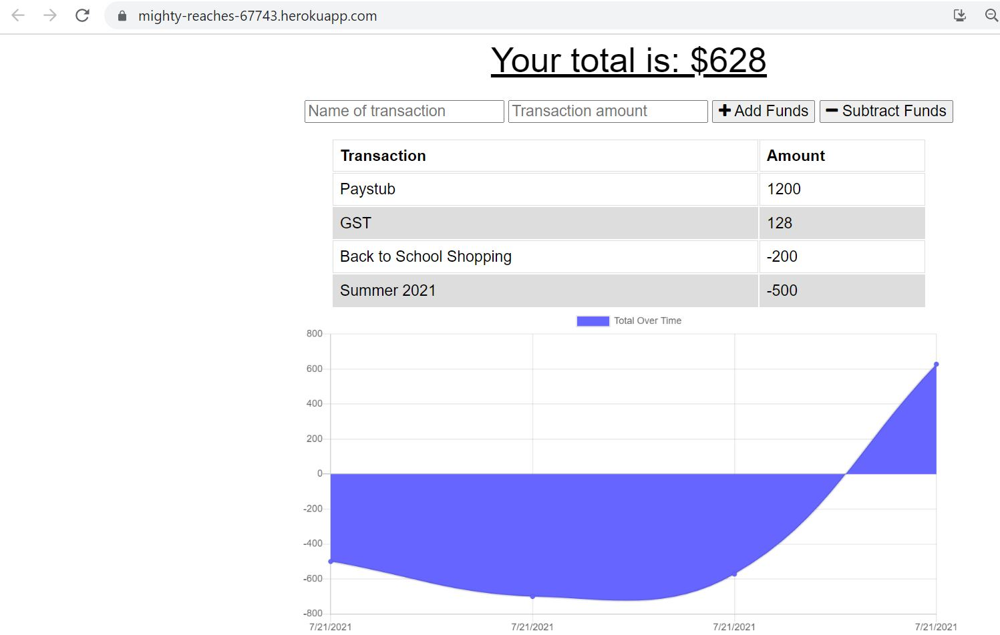

# BudgetTracker
With this Progressive Web Application, the user will be able to add deposits and deduct expenses to their budget with or without an internet connection. If the user enters transactions while offline, the total will be updated when they're brought back online.  This app can be installed on your computer or mobile device.

## Deployed Link
https://mighty-reaches-67743.herokuapp.com/ 

## Screenshot of Application



## Technologies Used
* Node.js
* Express.js
* MongoDB
* Mongoose
* IndexedDB
* PWA

## User Story

```
AS AN avid traveler
I WANT to be able to track my withdrawals and deposits with or without a data/internet connection
SO THAT my account balance is accurate when I am traveling 
```

### Acceptance Criteria

```
GIVEN a budget tracker without an internet connection
WHEN the user inputs an expense or deposit
THEN they will receive a notification that they have added an expense or deposit
WHEN the user reestablishes an internet connection
THEN the deposits or expenses added while they were offline are added to their transaction history and their totals are updated
```

## Author
Jessica Jeyanthiran is a student of the Univerity of Toronto Coding Boot Camp Spring 2021. <br/>
Find me on GitHub: https://github.com/JessicaJeyanthiran 